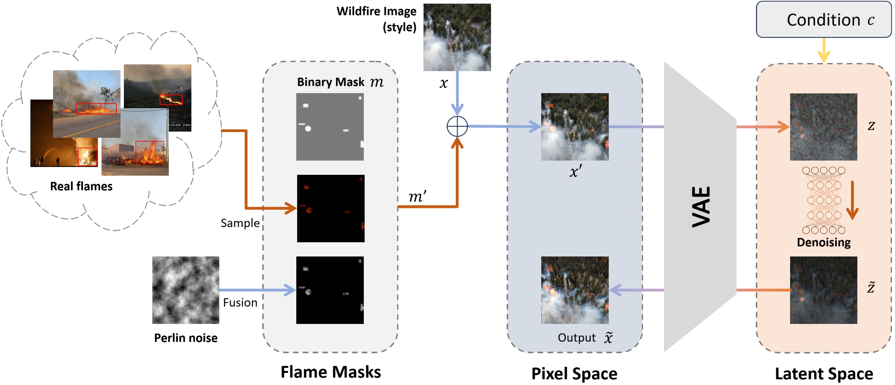
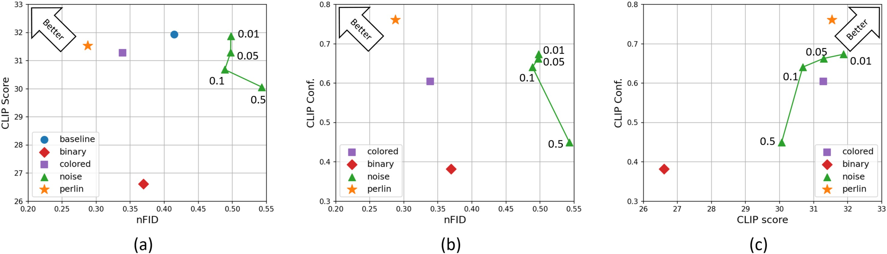

# FLAME Diffuser: Wildfire Image Synthesis using Mask Guided Diffusion

News: This paper is accepted by the [IEEE BigData 2024](https://www3.cs.stonybrook.edu/~ieeebigdata2024/)


## Introduction

Wildfires have devastating impacts on natural environments and human settlements. Existing fire detection systems rely on large, annotated datasets that often lack geographic diversity, leading to decreased generalizability. To address this, we introduce the **FLAME Diffuser**, a diffusion-based framework that synthesizes high-quality wildfire images with precise flame location control. This training-free framework eliminates the need for model fine-tuning, enhancing the development of robust wildfire detection models.

## Quick Tutorial
1. First, please download stable-diffusion-v1-5 model file from: [https://huggingface.co/stable-diffusion-v1-5/stable-diffusion-v1-5/resolve/main/v1-5-pruned.ckpt](https://huggingface.co/stable-diffusion-v1-5/stable-diffusion-v1-5/resolve/main/v1-5-pruned.ckpt) and place it into the `FLAME_SD\models\ldm\stable-diffusion-v1\` folder. <br>

2. Run `Flame_diffuser_perlin_mask.py` as a demo to show the proposed 'perlin_mask' method from the paper.

3. Go to [exp](exp) to check the mask-related functions such as `mask_generator.py` <br>
Run `dataset_eval.py` to produce the results of FID, CLIP Score, and CLIP Confidence. It will generate annotation for the test folder as well.

We will update more details later according to the request. Please contact us anytime if you have questions.

## Sample Dataset


- **Dataset:** Download from [FLAME_SD_Dataset](https://github.com/AIS-Clemson/FLAME_SD_Dataset)

---


## Key Features

- **Training-Free Diffusion Framework:** Generates wildfire images without the need for model training or fine-tuning.
- **Precise Flame Control:** Utilizes noise-based masks for accurate flame placement.
- **Diverse Backgrounds:** Creates images with varied and realistic backgrounds, enhancing model generalizability.
- **High-Quality Dataset:** Introduces FLAME-SD with 10,000 synthesized images for robust model training.

## Methodology



1. **Mask Generation:** 
   - Masks are generated to define areas for fire elements using fundamental shapes like rectangles and circles.
   - Perlin noise is added to the masks to create a smoother integration process.

2. **Diffusion Process:**
   - Combines masks with raw images, processed through a Variational Autoencoder (VAE) to generate latent variables.
   - The denoising U-Net refines these variables to produce realistic images guided by text prompts.


## Experimental Results



- **High-Quality:** Lowest FID score compared to other methods, indicating better realistic styles.
- **Consistency:** Image content does not shift, the semantic information is well-kept in synthesized images.


For more details, visit the [Project Page](https://arazi2.github.io/aisends.github.io/project/flame).


---
# Contact

**Contribution:** <br>
[AIS-Clemson](https://github.com/AIS-Clemson) <br>
[xiwenc1](https://github.com/xiwenc1) <br>
[abastola0](https://github.com/abastola0) <br>
[HuayuLiArizona](https://github.com/HuayuLiArizona) <br>
[ChongQingNoSubway](https://github.com/ChongQingNoSubway) <br>

**Authors:** Hao Wang, Sayed Pedram Haeri Boroujeni, Xiwen Chen, Ashish Bastola, Huayu Li, Wenhui Zhu, and Abolfazl Razi

**Affiliations:** Clemson University, The University of Arizona, Arizona State University

**Corresponding Author:** Abolfazl Razi (Email: <arazi@clemson.edu>)

# Acknowledgments
This project is supported by the National Science Foundation under Grant Number CNS-2204445. Special thanks to USDA Forest Service and Kaibab National Forest administration. <br>

Special thanks to Dr. [Siyu Huang](https://siyuhuang.github.io/) for his comments on experiment designs. 

# Citation 
<a href="https://doi.ieeecomputersociety.org/10.1109/BigData62323.2024.10826040">FLAME Diffuser: Wildfire Image Synthesis using Mask Guided Diffusion</a>

```
@INPROCEEDINGS {10826040,
author = { Wang, Hao and Haeri Boroujeni, Sayed Pedram and Chen, Xiwen and Bastola, Ashish and Li, Huayu and Zhu, Wenhui and Razi, Abolfazl },
booktitle = { 2024 IEEE International Conference on Big Data (BigData) },
title = {{ FLAME Diffuser: Wildfire Image Synthesis using Mask Guided Diffusion }},
year = {2024},
volume = {},
ISSN = {},
pages = {6171-6179},
doi = {10.1109/BigData62323.2024.10826040},
url = {https://doi.ieeecomputersociety.org/10.1109/BigData62323.2024.10826040},
publisher = {IEEE Computer Society},
address = {Los Alamitos, CA, USA},
month =Dec}
```
